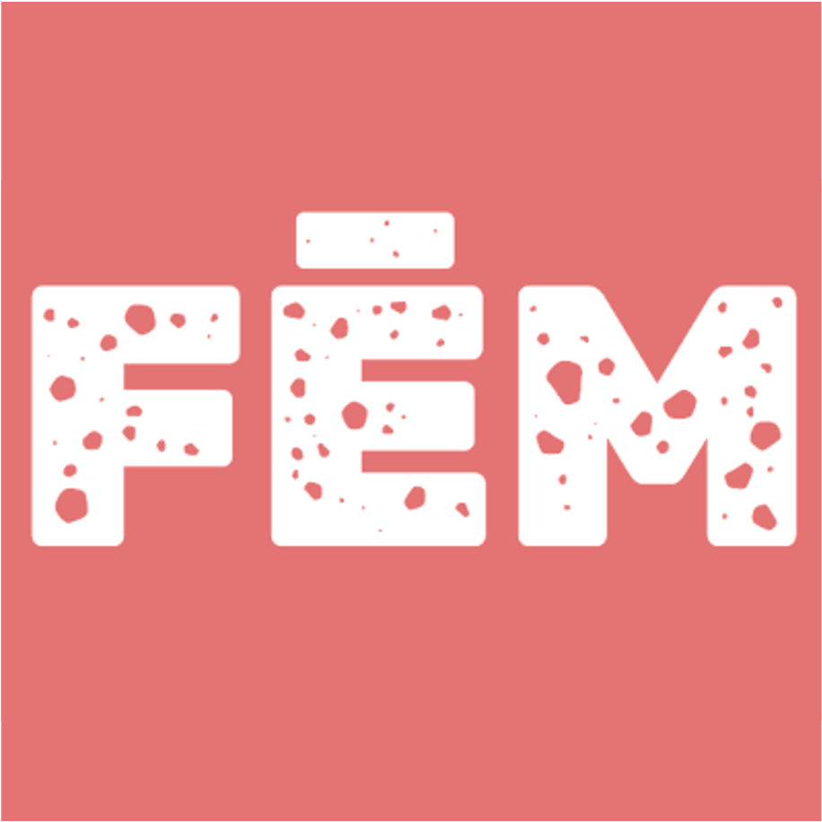

 

  

  <h1 align="center">Fem Readup</h1>

  

    Meta search engine for feminist media and events
  

## About The Project

The aim of Fem Readup is 
* to [crawl websites](https://github.com/fem-readup/fem-readup-search-engine-crawler) for upcoming events
* let an editorial office update and add events
* to [provide a meta search engine](https://github.com/fem-readup/fem-readup-search-engine-ng) to find events

### Built With

* [Python](https://www.python.org/) to implement web crawlers
* [Hugo](https://gohugo.io/) to allow for manual update of content
* [Firebase](https://firebase.google.com/) to store event data
* [Angular](https://firebase.google.com/) to display events

## Roadmap

See the open issues for [Python-based crawlers](https://github.com/fem-readup/fem-readup-search-engine-crawler/issues) and the [Angular-based frontend](https://github.com/fem-readup/fem-readup-search-engine-ng/issues).

## License

tbd

## Contact

Florian Schwanz - florian.schwanz@gmail.com
